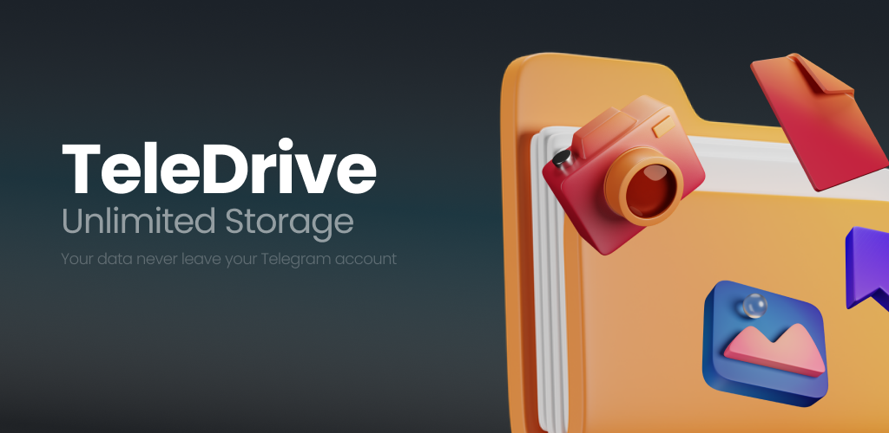

# TeleDrive

TeleDrive is an open-source Android application built with Flutter and Kotlin that turns a Telegram account into a personal cloud drive. It uses Telegram's official API through TDLib to upload, organize, preview, search, and download files stored in Saved Messages and private channels.

<div align="center">

[](LICENSE)
[]()

[](https://play.google.com/store/apps/details?id=dev.aliabdollahzadeh.teledrive)

[](https://github.com/ali-abdollahzadeh/teledrive/releases/latest)



</div>

> [!CAUTION]
> TeleDrive uses your own Telegram account as the storage layer. Heavy, automated, or abnormal upload activity may trigger Telegram limits or account restrictions. Use the app responsibly, respect Telegram's Terms of Service, and do not upload illegal, copyrighted, harmful, or abusive content.

## Project status

TeleDrive is actively maintained and available through Google Play and GitHub Releases. Bug reports, feature requests, and contributions are welcome through GitHub Issues and pull requests.

## Features

- **Native TDLib integration** — a native Kotlin implementation of TDLib (`tdlibx`) communicates with Flutter using MethodChannels and EventChannels.
- **Secure authentication** — supports phone-number login, verification codes, and Telegram 2FA.
- **Persistent sessions** — authentication state is stored securely on the device.
- **Folder management**
  - Uses **Saved Messages** as the default storage location.
  - Discovers channels and supergroups where the user has upload permissions and exposes them as folders.
  - Creates private Telegram channels when a new TeleDrive folder is created.
- **File operations**
  - Upload and download files.
  - Track transfer progress.
  - Preview supported formats.
  - Categorize files into documents, images, videos, audio, PDFs, and archives.
- **Modern Flutter UI** — Riverpod for state management and GoRouter for navigation.

## Tech stack

- **Frontend:** Flutter / Dart
- **Native Android layer:** Kotlin
- **Telegram integration:** TDLib via `tdlibx`
- **State management:** Riverpod
- **Routing:** GoRouter
- **Secure storage:** Flutter Secure Storage
- **Platform bridge:** Flutter MethodChannel and EventChannel

## Architecture

The application follows a feature-oriented structure with separate areas for authentication, drive operations, previews, search, and settings.

The core integration is the **TDLib bridge**:

1. **Dart layer (`NativeTelegramChannel`)** exposes methods such as `uploadFile`, `downloadFile`, and `getMyChats`, plus streams for authentication and file updates.
2. **Method/Event Channels** carry commands and events between Flutter and Android.
3. **Kotlin plugin (`TelegramPlugin`)** receives Flutter requests and routes them to the native layer.
4. **Kotlin manager (`TelegramManager`)** initializes TDLib, manages the active client, handles file locking, executes Telegram API calls, and processes real-time updates.

## Getting started

### Prerequisites

- Flutter SDK (latest stable version recommended)
- Android Studio / Android SDK
- A Telegram API ID and API Hash from [my.telegram.org](https://my.telegram.org/)

### Installation

1. Clone the repository:

   ```bash
   git clone https://github.com/ali-abdollahzadeh/teledrive.git
   cd teledrive
   ```

2. Install dependencies:

   ```bash
   flutter pub get
   ```

3. Run the app on an Android emulator or connected Android device:

   ```bash
   flutter run
   ```

### Usage

1. Enter your Telegram API ID, API Hash, and phone number.
2. Enter the verification code sent by Telegram.
3. Complete 2FA if it is enabled on the account.
4. Browse Saved Messages and eligible channels, create folders, and upload or download files.

## Roadmap

Current areas of interest include:

- Folder upload support, including optional automatic ZIP creation.
- More detailed upload/download speed and progress information.
- More reliable background transfers on Android.
- Broader automated test coverage.
- Exploring iOS support through a native Swift/Objective-C TDLib bridge.

Roadmap items are not commitments to a specific release date. Feature proposals and implementation ideas are welcome in [GitHub Issues](https://github.com/ali-abdollahzadeh/teledrive/issues).

## Contributing

Contributions are welcome. Please read [CONTRIBUTING.md](CONTRIBUTING.md) before opening a pull request. For larger changes, open an issue first so the implementation approach can be discussed.

## Current limitations

- **Android only:** the current native TDLib bridge is implemented in Kotlin. iOS support would require a Swift/Objective-C implementation.
- **Background transfers:** uploads and downloads currently work most reliably while the app is in the foreground; full Android background-service integration remains future work.

## License

TeleDrive is released under the [MIT License](LICENSE).
